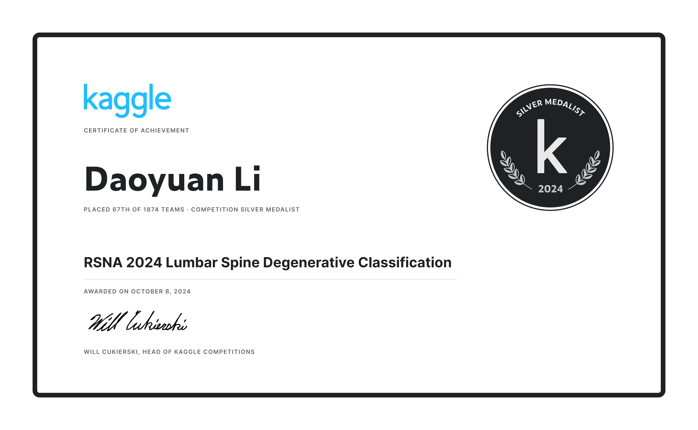

# RSNA 2024 Lumbar Spine Degenerative Classification Solution

This solution was developed for the [RSNA 2024 Lumbar Spine Degenerative Classification](https://www.kaggle.com/competitions/rsna-2024-lumbar-spine-degenerative-classification/overview) competition on Kaggle, where participants were challenged to create models to detect and classify degenerative spine conditions based on lumbar spine MRI images. The task required building a model capable of predicting five different degenerative spine conditions and their severity levels across multiple disc levels. By simulating the diagnostic process of a radiologist, our model aims to enhance the accuracy and efficiency of lumbar spine assessments.

Our team achieved a **Silver Medal**, placing **in the top 5%** of participants, with a public score of **0.43** and a private score of **0.49**. Our solution showcased the potential for using deep learning models, specifically YOLOv8, to classify lumbar spine conditions with high accuracy, contributing to the potential clinical utility of AI in radiological diagnostics. 🥈



## Competition Overview

The goal of this competition is to develop models to assist in the detection and classification of degenerative spine diseases using lumbar spine MRI images. Participants will create models that simulate the radiologist’s diagnostic process for assessing spine conditions. 

### Classification of Five Lumbar Spine Degenerative Diseases:
1. Left Neural Foraminal Narrowing
2. Right Neural Foraminal Narrowing
3. Left Facet Joint Narrowing
4. Right Facet Joint Narrowing
5. Spinal Canal Stenosis

For each imaging study in the dataset, severity scores (Normal/Mild, Moderate, or Severe) are provided for the five degenerative conditions at the L1/L2, L2/L3, L3/L4, L4/L5, and L5/S1 disc levels.

## Data Files

- **train.csv**: Labels for the training set.
  - **study_id**: Unique identifier for each study, which may include multiple image series.
  - **[condition]_[level]**: Target labels, such as spinal_canal_stenosis_l1_l2, with severity levels Normal/Mild, Moderate, or Severe. Some entries may have missing labels.
  
- **train_label_coordinates.csv**
  - **study_id**
  - **series_id**: Unique identifier for the image series.
  - **instance_number**: The image sequence number within the 3D stack.
  - **condition**: Three primary conditions – spinal canal stenosis, foraminal narrowing, and facet joint narrowing. The latter two consider each side of the spine.
  - **level**: Relevant vertebrae, such as l3_l4.
  - **[x/y]**: x/y coordinates for the center of the labeled area.
  
- **sample_submission.csv**
  - **row_id**: Combination of study_id, condition, and level, e.g., 12345_spinal_canal_stenosis_l3_l4.
  - **[normal_mild/moderate/severe]**: Three prediction columns.

- **[train/test]_images/[study_id]/[series_id]/[instance_number].dcm**: Image data files.

- **[train/test]_series_descriptions.csv**
  - **study_id**
  - **series_id**
  - **series_description**: Direction of the scan.

### Evaluation Metric

The submission evaluation uses the mean weighted log loss, along with an any_severe_spinal prediction generated by the metric. A notebook with the metric details is available.

- **Sample Weights**:
  - Normal/Mild: 1
  - Moderate: 2
  - Severe: 4
  
For each row ID in the test set, you must predict the probability for each severity level. The submission file should contain a header and be in the following format:
```plaintext
row_id,normal_mild,moderate,severe
123456_left_neural_foraminal_narrowing_l1_l2,0.333,0.333,0.333
123456_left_neural_foraminal_narrowing_l2_l3,0.333,0.333,0.333
123456_left_neural_foraminal_narrowing_l3_l4,0.333,0.333,0.333
...
```

In rare cases where the lowest vertebrae are not visible in the image, you still need to make a prediction, as empty values will result in errors. However, these rows will not be scored.

## Solution Overview

Our solution involves building a multi-model approach with **YOLOv8** to detect and classify lumbar spine degenerative conditions, predicting the level and condition boundaries simultaneously.

- **Neural Foraminal Narrowing (NFN)**: Model predicts 5 levels * 2 sides (left/right) * 3 conditions = 30 labels.
- **Spinal Canal Stenosis (SCS)**: Model predicts 5 levels * 3 conditions = 15 labels.
- **Facet Joint Narrowing (SS)**: Model predicts 5 levels * 2 sides (left/right) * 3 conditions = 30 labels.

This yields a total of 75 bounding box classes. These are aggregated by taking the maximum value within each condition_level grouping to obtain the final predictions at the study level.

### Data Preprocessing

During data preprocessing, we address three distinct lumbar spine degenerative patterns: left/right neural foraminal narrowing, spinal canal stenosis, and left/right facet joint narrowing. The preprocessing steps are as follows:

1. **Data Loading & Merging**:
   - Load data from various CSV files, including `train.csv`, `train_label_coordinates.csv`, and `train_series_descriptions.csv`, containing image labels, coordinates, and sequence descriptions. 
   - Additionally, load the 5-fold cross-validation split file `5folds.csv` for model training and validation.

2. **Extract Conditions & Levels**:
   - For each image label, extract the type of degenerative disease (e.g., spinal canal stenosis, neural foraminal narrowing) and the vertebrae level (e.g., L1/L2). Custom functions `get_level` and `get_condition` are used to transform fields (e.g., l1_l2) into standard formats while extracting the specific condition for each label.

3. **Label Data Construction**:
   - Merge the data above to create a structured label DataFrame containing `study_id`, `condition`, `level`, and `label`, making it easier to convert into the model input format.

4. **DICOM Image Processing & YOLO Format Generation**:
   - Read `.dcm` MRI images using the `pydicom` library, standardize the pixel values to the 0-255 range, and convert them to RGB. 
   - Convert image labels to YOLO bounding box format, generating `.txt` files with the class ID, center coordinates, bounding box width, and height.

5. **Train/Validation Split & Data Output**:
   - Split the data into training and validation sets according to the folds file. Each fold outputs images and labels in a YOLO-compatible format.

## Training the YOLOv8 Model

Using 5-fold cross-validation, we train a separate YOLOv8 model for each degenerative disease pattern. Each model follows a similar training process with some variation in dataset selection and hyperparameters:

- Input image size: 384x384
- Batch size: 64
- Epochs: 40

### Parameter Variations by Disease Pattern:

| Parameter                | NFN (Neural Foraminal Narrowing) | SCS (Spinal Canal Stenosis) | SS (Facet Joint Narrowing) |
|--------------------------|-----------------------------------|-----------------------------|-----------------------------|
| Model Weight File        | yolov8m.pt                       | yolov8s.pt                  | yolov8s.pt                  |
| Class Loss Weight (cls)  | 0.5                              | 1.0                         | 0.5                         |
| Learning Rate (lrf)      | 0.01                             | 0.001                       | 0.005                       |
| HSV - Hue                | 0.0                              | 0.015                       | 0.015                       |
| HSV - Saturation         | 0.0                              | 0.7                         | 0.7                         |
| HSV - Value              | 0.4                              | 0.4                         | 0.4                         |
| Translate                | 0.0                              | 0.1                         | 0.0                         |
| Scale                    | 0.2                              | 0.2                         | 0.2                         |
| Crop Fraction            | 0.8                              | 1.0                         | 1.0                         |
| Mixup                    | 0.0                              | 0.0                         | 0.1                         |

## Inference and Submission

1. **Data Filtering & Preprocessing**:
   - For each model, we select the relevant image sequences based on `series_description`. For example:
     - SCS model infers on images from the Sagittal T2/STIR sequences.
     - NFN model infers on Sagittal T1 sequences.
     - SS model infers on Axial T2 sequences.

2. **Model Inference**:
   - Load the pre-trained YOLOv8 weights and apply each model to the JPEG images. YOLOv8 returns categories and confidence scores for each bounding box.

3. **Bounding Box Prediction Aggregation**:
   - The `infer` function aggregates confidence scores across the condition_level_severity categories, selecting the maximum score for each category to form the final predictions.

4. **Confidence Normalization**:
   - The model’s severity confidence scores are normalized to sum to 1, transforming them into a probability distribution that aligns with competition scoring.

---

### Solution Summary

Our team achieved a silver medal in the RSNA 2024 Lumbar Spine Degenerative Classification competition, with a public score of 0.43 and a private score of 0.49. We implemented a multi-model approach with YOLOv8 and developed custom data preprocessing and target detection processes, optimizing predictions through confidence aggregation. Our solution demonstrates potential clinical applicability for assisting radiologists in diagnostics.

**Highlights:**
- Developed a YOLOv8-based framework for classifying three degenerative spine disease patterns
- Designed a unique data preprocessing pipeline for DICOM image handling and YOLO format conversion
- Implemented a bounding box prediction aggregation method to enhance robustness across MRI sequences

**Technical Expertise:**
- Proficient in deep learning frameworks like PyTorch and YOLOv8
- Experienced in computer vision techniques for medical imaging data
- Skilled in efficient data processing and model optimization

**Achievements:**
- RSNA 2024 Lumbar Spine Degenerative Classification competition silver medal
- Public score: 0.43, Private score: 0.49, showcasing strong generalization capability
- Solution holds potential clinical value for aiding radiologists in diagnostics
